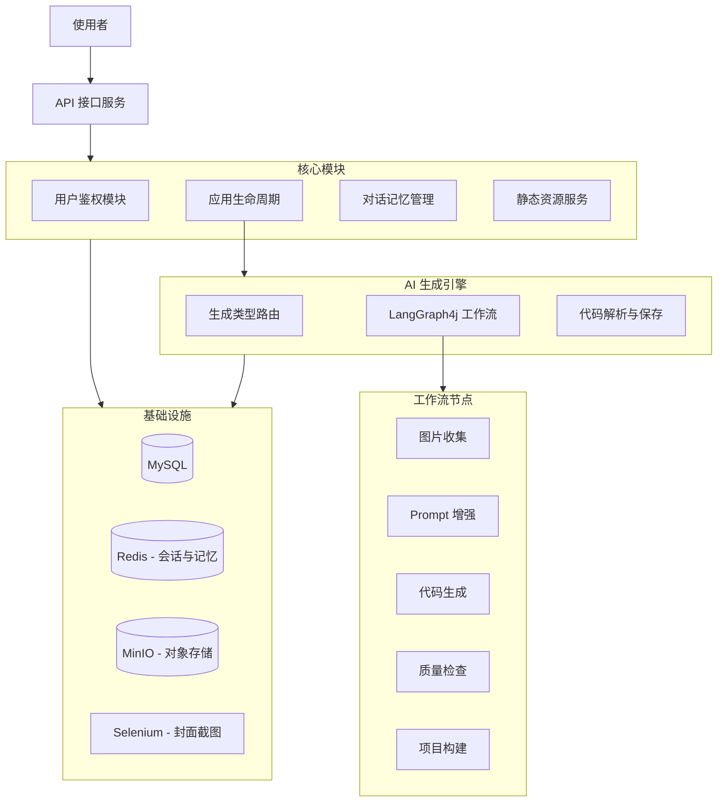
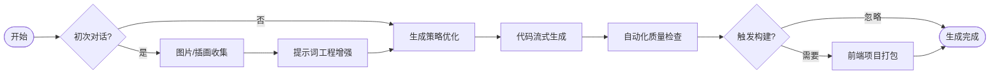

# 🚀 NoCodePlatform: 智能化 0 代码应用生成引擎 

[](https://www.oracle.com/java/technologies/javase/jdk21-archive-downloads.html)
[](https://spring.io/projects/spring-boot)
[](LICENSE)

> **NoCodePlatform** 是一款基于 大语言模型 (LLM) 驱动的 0 代码应用生成平台。它能够将用户的自然语言描述（Prompt）转化为功能完备的 Web 应用，集成了业界领先的 AI 编排技术与自动化部署流程。

---

## 📖 目录
- [1 项目介绍](#1-项目介绍)
- [2 功能介绍](#2-功能介绍)
- [3 技术架构](#3-技术架构)
- [4 工作流设计](#4-工作流设计)
- [5 快速开始](#5-快速开始)
- [6 项目结构](#6-项目结构)
- [7 核心设计](#7-核心设计)
- [8 Roadmap](#8-roadmap)
- [9 贡献](#9-贡献)
- [10 License](#10-license)

---

## 1 项目介绍
NoCodePlatform 旨在消除技术壁垒，让非开发人员也能通过“对话即开发”的方式构建应用。系统不仅生成代码，还涵盖了从 **图片资源收集 -> 提示词增强 -> 代码生成 -> 质量检查 -> 自动化部署** 的全生命周期管理。

---

## 2 功能介绍
### 🌟 核心特性
*   **🤖 智能生成**：基于 LangChain4j 与通义千问 (DashScope) 实现流式交互生成。
*   **🛠️ 自动化流水线**：集成 LangGraph4j 编排复杂的生成节点。
*   **🖼️ 动态配图**：生成过程中并发收集匹配的 UI 图片资源。
*   **📊 实时反馈**：通过 SSE 实现细粒度的生成进度推送（心跳机制防止连接超时）。
*   **🌐 一键预览/部署**：支持静态资源托管，自动生成预览链接与封面截图。
*   **🔐 完善权限**：基于 AOP 实现的优雅权限控制系统 (Admin/User)。

---

## 3 技术架构
项目采用现代化的微服务单体架构设计，确保高性能与易维护性。

### 🏗️ 系统架构图


---

## 4 工作流设计
生成流程由 **LangGraph4j** 强力驱动，确保 LLM 的输出遵循严格的项目规范。



---

## 5 快速开始
### 📋 环境准备
*   **Java**: 21+
*   **Database**: MySQL 8.0+, Redis 7.0+
*   **Storage**: MinIO (或兼容 S3 的存储)
*   **Tools**: Node.js/npm (构建前端), Maven 3.9+

### 🚀 启动指南
1.  **克隆项目**
    ```bash
    git clone https://github.com/your-username/NoCodePlatform.git
    cd NoCodePlatform
    ```

2.  **配置环境**
    在 `src/main/resources/application-local.yml` 中配置以下信息：
    *   MySQL/Redis 连接信息
    *   MinIO `endpoint`, `ak`, `sk`
    *   DashScope API Key (`langchain4j.community.dashscope.chat-model.api-key`)

3.  **运行项目**
    ```bash
    mvn spring-boot:run
    ```

4.  **访问接口**
    *   API 文档 (Knife4j): `http://localhost:8790/api/doc.html`
    *   默认服务端口: `8790`

---

## 6 项目结构
```text
NoCodePlatform
├── src/main/java/my/nocodeplatform
│   ├── ai/               # AI 核心逻辑与提示词处理
│   ├── controller/       # RESTful 接口层
│   ├── entity/           # 数据库映射对象 (MyBatis-Flex)
│   ├── langgraph4j/      # LangGraph4j 工作流节点与编排
│   ├── model/            # DTO、VO 与枚举定义
│   ├── progress/         # 进度推送进度条心跳机制
│   └── service/          # 核心业务逻辑
├── src/main/resources
│   ├── prompt/           # 精心调优的 AI 提示词模板
│   └── application.yml   # 系统配置文件
└── docs/                 # 技术对接文档与规范说明
```

---

## 7 核心设计
### 🧱 统一鉴权 (AuthCheck)
利用 Spring AOP 结合自定义注解，实现零侵入的权限校验：
```java
@AuthCheck(mustRole = UserConstant.ADMIN_ROLE)
@PostMapping("/delete")
public BaseResponse<Boolean> deleteUser(@RequestBody DeleteRequest deleteRequest) { ... }
```

### ⚡ 流式进度反馈
基于 SSE (Server-Sent Events) 的进度推送系统，支持分阶段状态实时更新。

---

## 8 Roadmap
- [x] 基于 LangGraph4j 的工作流引擎
- [x] 多模式代码生成与质量检查
- [x] 自动化部署与封面截图
- [ ] 更多 UI 组件库适配 (Tailwind/Element Plus)
- [ ] 可视化工作流编辑界面
- [ ] 移动端 H5 混合生成模式

---

## 9 贡献
欢迎提交 Pull Request 或 Issue！
1. Fork 本仓库
2. 创建特性分支 (`git checkout -b feature/AmazingFeature`)
3. 提交更改 (`git commit -m 'Add some AmazingFeature'`)
4. 推送到分支 (`git push origin feature/AmazingFeature`)
5. 开启 Pull Request

---

## 10 License
本项目采用 [MIT License](LICENSE) 开源。

---
<p align="center">Made with ❤️ for the Future of No-Code Development</p>
