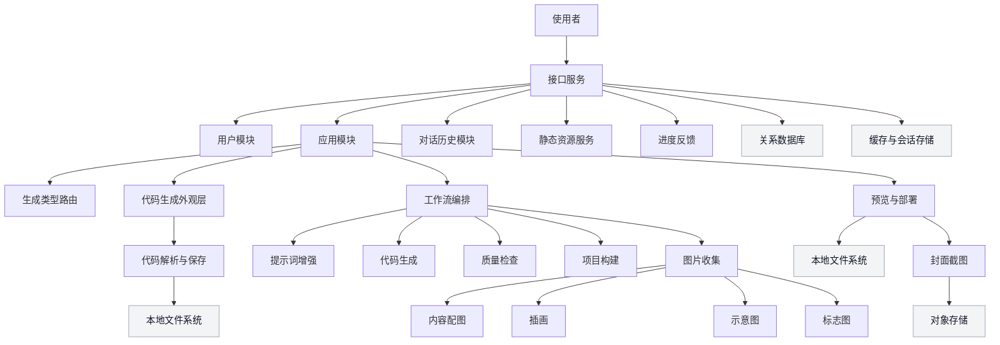
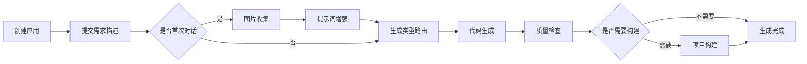
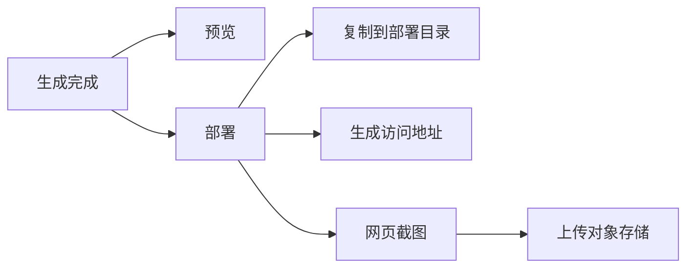

# 0代码应用生成平台

## 简介
本项目是一个 0 代码应用生成平台，面向非开发用户与轻量开发需求，通过填写初始需求描述自动生成应用代码，并提供应用管理、预览与部署能力。

## 主要能力
- 账号注册、登录、注销与会话管理
- 应用创建、编辑、删除、查询与精选展示
- 基于对话的代码生成，支持流式返回
- 智能路由选择生成类型，支持多种生成模式
- 并发图片收集、提示词增强、质量检查与项目构建
- 生成结果预览、部署与静态资源访问
- 自动截图生成封面并上传到对象存储
- 生成过程进度推送与心跳机制

## 架构图


## 关键流程
### 应用创建与代码生成


### 预览与部署


## 功能模块说明
### 用户模块
- 用户注册、登录与注销
- 登录态存储在会话中并持久化到缓存
- 管理员可进行用户增删改查

### 应用模块
- 应用创建、编辑、删除、查询
- 精选应用分页查询
- 应用预览与部署
- 自动截图生成封面并更新

### 对话历史模块
- 记录用户与模型的对话历史
- 支持按应用分页查询
- 历史记录可加载到对话记忆中

### 生成与工作流模块
- 生成类型路由与策略选择
- 多模式生成与保存
- 并发图片收集、提示词增强、质量检查与构建
- 支持流式输出与进度推送

### 静态资源服务
- 预览目录与部署目录静态资源访问
- 图片封面与生成资源访问

## 目录结构
- `src/main/java/my/nocodeplatform/controller` 接口层
- `src/main/java/my/nocodeplatform/service` 业务层
- `src/main/java/my/nocodeplatform/entity` 实体对象
- `src/main/java/my/nocodeplatform/model` 传输对象与枚举
- `src/main/java/my/nocodeplatform/ai` 生成相关能力
- `src/main/java/my/nocodeplatform/langgraph4j` 工作流与节点
- `src/main/java/my/nocodeplatform/progress` 进度推送
- `src/main/resources/prompt` 生成提示词模板
- `src/main/resources/mapper` 映射文件
- `docs` 进度与前端对接文档

## 技术与依赖概览
- `Java 21`
- `Spring Boot`
- `MyBatis-Flex`
- `MySQL`
- `Redis`
- `LangChain4j`
- `LangGraph4j`
- `MinIO`
- `Selenium`
- `HikariCP`
- `Caffeine`

## 配置说明
### 基础配置
- 服务端口与上下文路径位于 `src/main/resources/application.yml`
- 当前默认启用本地配置文件 `application-local.yml`

### 本地配置要点
以下配置涉及外部服务与密钥，需要按实际环境替换：
```yaml
spring:
  datasource:
    url: jdbc:mysql://localhost:3306/no_code_platform
    username: 你的账号
    password: 你的密码
spring:
  data:
    redis:
      host: localhost
      port: 6379
langchain4j:
  community:
    dashscope:
      chat-model:
        api-key: 你的密钥
minio:
  endpoint: http://localhost:9000
  access-key: 你的密钥
  secret-key: 你的密钥
  bucket: nocodeplatform
```

### 重要安全提示
- 不要在公共仓库提交真实密钥
- 推荐使用环境变量或私有配置文件覆盖
- 生产环境建议启用独立的对象存储与缓存实例

## 快速开始
### 环境准备
- `JDK 21`
- `Maven`
- `MySQL`
- `Redis`
- `MinIO`
- `Node.js` 与 `npm`（用于项目构建）
- 本地浏览器驱动环境（用于网页截图）

### 数据库准备
1. 创建数据库 `no_code_platform`
1. 根据实体类创建表结构，字段参考如下文件
`src/main/java/my/nocodeplatform/entity/User.java`
`src/main/java/my/nocodeplatform/entity/App.java`
`src/main/java/my/nocodeplatform/entity/ChatHistory.java`

### 启动服务
```bash
mvn spring-boot:run
```

### 访问地址
- 接口根路径：`http://localhost:8790/api`
- 部署访问基地址：`http://localhost:8005`

## 接口概览
### 用户相关
- `POST /user/register` 用户注册
- `POST /user/login` 用户登录
- `GET /user/get/login` 获取当前登录用户
- `POST /user/logout` 用户注销
- `POST /user/add` 管理员创建用户
- `GET /user/get` 管理员获取用户
- `POST /user/delete` 管理员删除用户
- `POST /user/update` 管理员更新用户
- `POST /user/list/page/vo` 管理员分页查询

### 应用相关
- `POST /app/add` 创建应用
- `POST /app/edit` 编辑应用
- `POST /app/delete` 删除应用
- `GET /app/get/vo` 获取应用详情
- `GET /app/get` 管理员获取应用详情
- `POST /app/list/page` 管理员分页查询
- `POST /app/list/page/vo` 精选应用列表
- `POST /app/my/list/page/vo` 我的应用列表
- `GET /app/chat/gen/code` 生成代码（流式）
- `POST /app/deploy` 部署应用
- `GET /app/preview/{appId}` 预览应用

### 对话历史
- `POST /chat_history/list/page` 管理员分页查询
- `POST /chat_history/list/page/vo` 应用对话历史视图

### 静态资源
- `GET /static/{deployKey}/` 访问部署资源
- `GET /static/pic/**` 访问图片资源

## 生成进度反馈
生成流程会通过流式响应推送进度数据，核心字段包括阶段、状态、百分比、提示信息与详细内容。详细规则见：
- `docs/ProgressFeedbackSpec.md`
- `docs/ProgressFeedbackSummary.md`
- `docs/FrontendUsageExample.md`

## 运行时目录说明
```text
tmp/code_output   生成结果目录
tmp/code_deploy   部署目录
tmp/screenshots   截图临时目录
```

## 常见问题
- 如果部署后访问为空，请确认构建结果已产出并复制到部署目录
- 如果截图失败，请检查本地浏览器驱动环境是否可用
- 如果生成类型不符合预期，可通过对话继续优化需求描述

## 参考脚本
- `test_app_endpoints.ps1` 基本接口联调脚本
