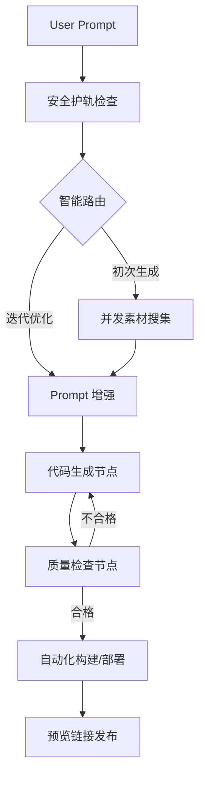

# 🤖 NoCodePlatform: 智能化 0 代码应用生成引擎

<p align="center">
  
  
  
  
  
</p>

**NoCodePlatform** 是一款基于 LLM 驱动的零代码生成平台。用户只需输入自然语言描述，即可由 AI Agent 自动执行从素材搜集、代码生成、质量检查到项目构建的完整工作流，最终一键生成可访问的 Web 应用。

[快速开始](#🚀-快速开始) | [核心特性](#🌟-核心特性) | [技术架构](#🏗️-技术架构) | [工作流设计](#🔄-工作流设计)

---

## 📸 界面预览

前端：https://github.com/qasax/NoCodePlatform

---

## 🌟 核心特性

- **🤖 声明式 AI 开发模型**: 利用 `LangChain4j` 集成千问等大模型，通过声明式 Ai Service 快速实现复杂的模型调用与应用逻辑。
- **📈 多 agent 协同编排**: 使用 `LangGraph4j` 实现多分支、多并发的自动化流水线。涵盖：
  - **素材智能搜集**: AI 自动规划并并发执行图片搜索任务，效率提升 **300%**。
  - **代码生成与解析**: 支持原生 HTML/JS 及 Vue 工程化网站生成模式。
  - **闭环质量检查**: 自动对生成内容进行审查，确保应用可用性。
- **🧠 深度对话与记忆**: 整合 `Redis` 实现对话历史持久化，支持多轮对话迭代优化，通过 `memoryId` 实现用户会话隔离。
- **⚡ 实时交互体验**: 基于 SSE 实现细粒度进度看板，用户可实时追踪 AI 的思考与工作路径。
- **🛡️ 安全与稳定性**: 内置 `Guardrails` 护轨机制，实现用户 Prompt 安全审查及 AI 响应自动重试保障。

---

## 🏗️ 技术架构

项目采用模块化设计，重点突出 AI 引擎层与业务逻辑层的解耦。

| 模块 | 技术栈 | 说明 |
| :--- | :--- | :--- |
| **后端核心** | Java 21 / Spring Boot 3.5 | 极速启动，原生 AOT 支持潜力 |
| **AI 编排** | LangChain4j / LangGraph4j | 业界领先的 Java AI 生态框架 |
| **数据库** | MySQL 8.0 / MyBatis-Flex | 灵活的 ORM 映射与权限管理 |
| **缓存/记忆** | Redis | 存储对话上下文与分布式会话 |
| **对象存储** | MinIO | 托管生成的网页静态资源与素材 |
| **自动化测试** | Selenium | 用于生成应用预览图与自动化校验 |

---

## 🔄 工作流设计

生成流程由 **LangGraph4j** 强力驱动，通过有向无环图 (DAG) 确保 LLM 的输出遵循严格的项目规范。



---

## 🚀 快速开始

### 📋 环境要求

- **JDK 21+**
- **Maven 3.9+**
- **MySQL 8.0+** & **Redis 7.0+**
- **MinIO** (本地或云端)
- **DashScope API Key** (阿里云百炼)

### 🛠️ 安装步骤

1. **克隆仓库**
   ```bash
   git clone https://github.com/your-username/NoCodePlatform.git
   cd NoCodePlatform
   ```

2. **数据库初始化**
   执行 `sql/create_table.sql` (如有) 初始化数据库表结构。

3. **配置参数**
   在 `src/main/resources/application-local.yml` 中填入你的配置：
   ```yaml
   spring:
     datasource:
       url: jdbc:mysql://localhost:3306/no_code_db
     data:
       redis:
         host: localhost
   
   langchain4j:
     community:
       dashscope:
         chat-model:
           api-key: your-dashscope-key
   ```

4. **启动应用**
   ```bash
   mvn spring-boot:run
   ```

---

## 💻 使用示例

### 调用生成接口

```java
// 利用 LangChain4j 的声明式服务实现网站生成
@AiService
public interface WebGenerator {
    @SystemMessage("你是一个专业的前端工程师，请根据需求生成代码...")
    String generate(@UserMessage String requirements);
}
```

### 业务集成示例

用户视角只需发送简单的 POST 请求：

```bash
curl -X POST http://localhost:8790/api/app/generate \
     -H "Content-Type: application/json" \
     -d '{
           "appName": "极简咖啡店展示页",
           "initPrompt": "帮我做一个复古风格的咖啡店主页，包含菜单、营业时间，配色要用暖色调"
         }'
```

---

## 📁 项目结构

```text
NoCodePlatform
├── src/main/java/my/nocodeplatform
│   ├── controller/       # 接口入口
│   ├── service/          # 核心业务 (AppService, UserService)
│   ├── ai/               # AI 核心提示词与逻辑
│   ├── langgraph4j/      # 工作流节点 (Nodes) 与状态管理 (State)
│   ├── mapper/           # MyBatis-Flex 数据层
│   └── model/            # DTO/VO/Enums
├── src/main/resources
│   ├── prompt/           # 精心调优的 Prompt 模板 (YAML/MD)
│   └── application.yml   # 系统配置
└── pom.xml               # 项目依赖管理
```

---

## 🤝 贡献指南

我们非常欢迎社区的贡献！

1. Fork 本项目
2. 创建您的 Feature 分支 (`git checkout -b feature/AmazingFeature`)
3. 提交您的修改 (`git commit -m 'Add some AmazingFeature'`)
4. 推送到分支 (`git push origin feature/AmazingFeature`)
5. 开启一个 Pull Request

---

## 📄 许可证

本项目基于 [MIT License](LICENSE) 协议开源。

---

<p align="center">
  Generated with ❤️ by <b>NoCodePlatform Team</b>
</p>
